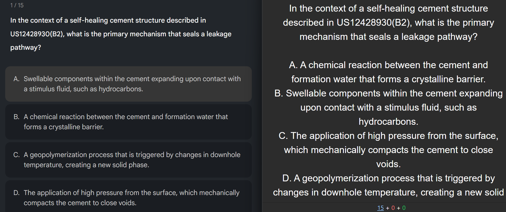
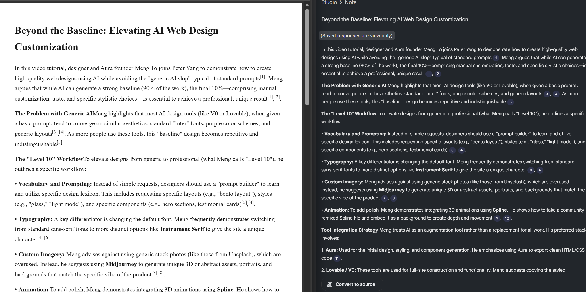
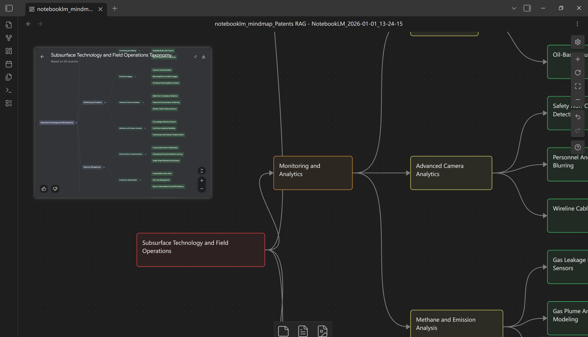

# Extension

Store listing: [Chrome Web Store](https://chromewebstore.google.com/detail/notebooklm-exportkit-expo/badkjigcpokmligdghppmippgfjhabmp)

## Demo






Copyright (C) 2026 kristol07

## Title

NotebookLM ExportKit - export NotebookLM content to any format

## Summary

Export NotebookLM chats, quizzes, flashcards, mindmaps, notes, reports, source details, data tables, and slide decks to multiple formats, with Google Drive and Notion delivery.

## Description

NotebookLM Export Kit is a purpose-built export tool for NotebookLM.

It turns your chats, quizzes, flashcards, mindmaps, notes, reports, source details, data tables, and slide decks into clean, reusable files so you can keep learning, organize research, and share results outside of NotebookLM.

NotebookLM ExportKit is open source (AGPLv3). Repo: https://github.com/kristol07/NotebookLM-ExportKit

If you rely on NotebookLM for study, teaching, or knowledge management, this extension makes your content portable and future‑proof.

What it does:

  - Export NotebookLM content to multiple formats (varies by content type).
  - Preserve structure for quizzes, flashcards, and mindmaps so exports stay readable and ready to use.
  - One-click exports designed for common workflows in Excel/Sheets, Anki, Obsidian, Notion, Word, PDF, PowerPoint (PPTX), and mind-mapping tools.
  - Send exports directly to Google Drive or Notion, or keep the default local download flow.

Why install:

  - Save time copying and reformatting manually.
  - Keep your NotebookLM outputs editable and shareable.
  - Use the same content across study tools, research docs, or team workflows.
  - Deliver files straight to Google Drive or Notion when you want cloud storage and easy sharing.

Who it’s for:
  Students, researchers, educators, and knowledge workers who want to move NotebookLM content into their own systems with minimal friction.

How to use:
  Simply open the content you want to export in NotebookLM first, then click button in the extension for the format you would like to receive, and you'll get it exported finally. That's all.


## Open Source Usage

### Requirements

- Node.js 20+ (recommended)
- pnpm 10+

### Install

```bash
pnpm install
```

### Development

```bash
pnpm dev
```

Browser-specific dev builds:

```bash
pnpm dev:edge
pnpm dev:firefox
```

### Build

```bash
pnpm build
pnpm zip
```

Browser-specific builds:

```bash
pnpm build:edge
pnpm build:firefox
pnpm zip:firefox
```

### Type Check

```bash
pnpm compile
```

### Configuration

Create `.env` from `.env.example`:

```bash
cp .env.example .env
```

- `VITE_SUPABASE_URL`: Supabase project URL
- `VITE_SUPABASE_PUBLISHABLE_DEFAULT_KEY`: Supabase publishable key
- `VITE_GOOGLE_DRIVE_CLIENT_ID`: Google OAuth client id for Drive uploads

Billing and Supabase edge functions use `.env.supabase` (optional unless you deploy billing):

```bash
cp .env.supabase.example .env.supabase
```

- `CREEM_API_KEY`
- `CREEM_WEBHOOK_SECRET`
- `CREEM_PRODUCT_ID_PLUS`
- `CREEM_SUCCESS_URL`

See `docs/GOOGLE_OAUTH_SETUP.md` and `docs/CREEM_BILLING.md` for setup details.

### License

This project is licensed under the GNU Affero General Public License v3.0. See `LICENSE`.
